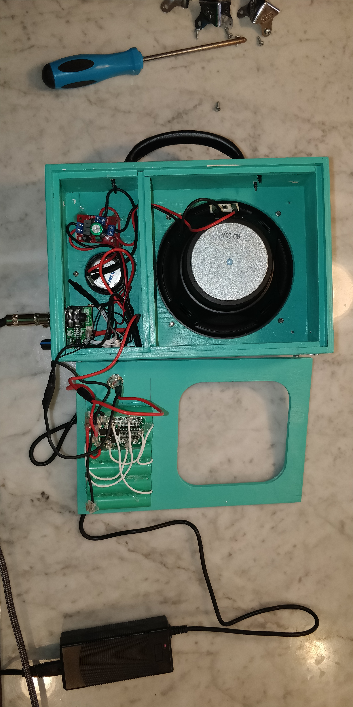

# Little Amp

60 Watt Mono Guitar Amp (its not really 60W).
Sound quality could be improved with housing that has calculated resonance body.  
Summer 2020  
Urs Utzinger  

## Bill of Materials

 * PreAmplifier, 12 or 24V  [Aliexpress](https://www.aliexpress.com/item/32919076168.html?spm=a2g0s.9042311.0.0.7aed4c4d8ikMiX)
 * Amplifier 60W Mono, 8-24V, [Aliexpress](https://www.aliexpress.com/item/4000722465701.html?spm=a2g0s.9042311.0.0.7aed4c4d8ikMiX)
 * Bass Speaker, AIYIMA 6.5 Inch Bass Audio Speakers 4 8 Ohm 40 W [AliExpress](https://www.aliexpress.com/item/32989791527.html?spm=a2g0s.9042311.0.0.7aed4c4d8ikMiX) (stamp on item says 30W)  
 * Tweeter Speaker, 20W, [Aliexpress](https://www.aliexpress.com/item/4000181813775.html?spm=a2g0s.9042311.0.0.b8924c4dlgBoov)
 * Frequency Divider 2 Way [Aliexpress](https://www.aliexpress.com/item/4000894307441.html?spm=a2g0s.9042311.0.0.b8924c4dlgBoov)
 * Battery 18650 [batterystore](https://www.18650batterystore.com/)
 * Battery Management 6S [AliExpress](https://www.aliexpress.com/item/32906948495.html?spm=a2g0s.9042311.0.0.7aed4c4d8ikMiX) this one neve arrived, so I got them from Amazon
 * Battery Management 6S [Amazon](https://www.amazon.com/gp/product/B08B66M894/ref=ppx_yo_dt_b_search_asin_title?ie=UTF8&psc=1)
 * Battery Charger 25.2V [AliExpress](https://www.aliexpress.com/item/32867465240.html?spm=a2g0s.9042311.0.0.7aed4c4d8ikMiX)
 * Hardware
   * Corner Elements, Stainless Steel Right Angles [Aliexpress](https://www.aliexpress.com/item/32949735441.html?spm=a2g0s.9042311.0.0.7aed4c4d8ikMiX)
   * Speaker Protection Grille [Aliexpress](https://www.aliexpress.com/item/32855538505.html?spm=a2g0s.9042311.0.0.7aed4c4d8ikMiX) 
   * Charger input 5.5x2.1mm [Amazon](https://www.amazon.com/gp/product/B07C46XMPT/ref=ppx_yo_dt_b_asin_title_o01_s00?ie=UTF8&psc=1)

Battery: 6 Lithium Ion batteries. welded together with nickel strips

## Cost
| Item | Cost|
|--|--|
| Preamp | $6.5 |
| Amp | $2.74 |
| Bass Speaker | $25  |
| Grille | $5 |
| Corner pieces | $3.5  |
| Tweeter | $13.5  |
| Frequency Divider | $3  |
| Charger | $10  |
| BMS | $1.40  |
| **Total** | **$70** |

Miscellaneous  items:

- Paint  

- Wires  

- Glue  

- Nickel strips for battery welding [Amazon](https://www.amazon.com/Bestol-Nickel-Strip-Battery-Welding/dp/B07Y5626R3/ref=sr_1_5?dchild=1&keywords=nickel+strip&qid=1595699022&sr=8-5)  

- Carry Handle/Pulls [Amazon](https://www.amazon.com/Lizavo-V171-Pulls-Black-Pack/dp/B01J7H7UFE/ref=psdc_511260_t1_B000BO8ZCA)  

## Speaker Housing

See Speaker.svg which is for 6.4mm thick plywood and layout for a laser cutter  
  
And the front art  Which we like to resemble 

## Assembled Product

 

